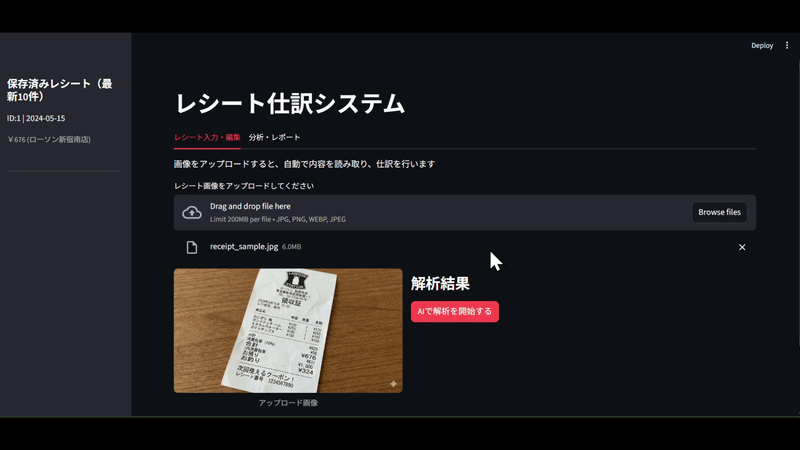
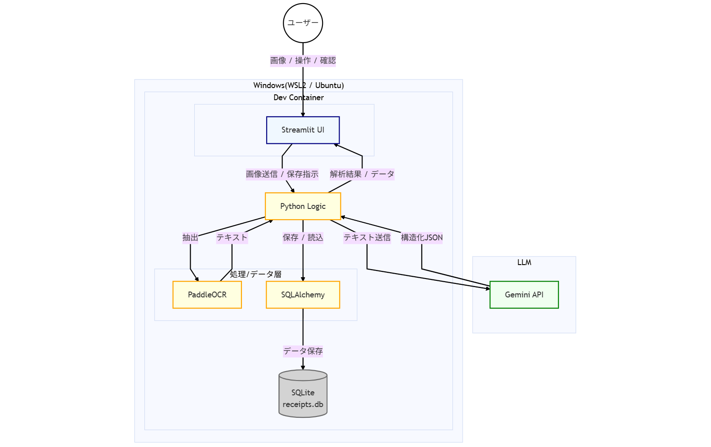

レシート自動仕訳システム

1.概要

本システムは、アップロードされたレシートの画像をOCR技術で読み取り、LLMを用いて「日付、店舗名、金額、カテゴリ」などの情報を構造化データとして自動抽出、データベース化するアプリケーションです。

Repository URL : https://github.com/soleid-hub/receipt_ocr_app

### 動作デモ
 
*※解析中の待ち時間は4倍速で表示しています。*

2.仕様技術

モダンな開発フローと保守性を重視し、以下の技術を選定しました。

Environment & Infrastructure
・OS:Windows(WSL2/Ubuntu)
・Containerization: Docker & Dev Containers
    選定理由：チーム開発を想定し、開発者のローカル環境に依存せず、開けば動く環境を構築するため。

Backend & Logic
・Language:Python3.12
・OCR　Engine : PaddleOCR
    選定理由：軽量かつ日本語認識精度が高いため
・LLM　: Google Gemini API(Gemini 2.5 Flash Lite)
    選定理由：高速かつ安価でJSONモードによる構造化出力に優れているため。
・Database:SQLite & SQLAlchemy
    選定理由：将来的なDB変更に強い設計と、手軽なポートビリティの両立

Frontend
・Framework: Streamlit
    選定理由：データサイエンス領域での親和性が高く、Pythonのみで迅速にUI構築・検証サイクルを回せるため。

Quality Control
・Linter/Formatter: Ruff
    選定理由：高速な解析により、型ヒントの共存やコード規約の統一を効率的に行うため。

3.システム構成図

4.機能・非機能
機能要件
・画像アップロード＆プレビュー：レシート画像の取り込みと表示
・AI自動解析：
    ・PaddleOCRによる文字情報の読み取り
    ・Gemini APIによる「日付」「店舗名」「合計金額」「カテゴリ」の自動抽出
・データ編集・バリデーション：AIの解析結果をユーザーが画面上で修正できる機能
・データ保存：解析結果をデータベースへ永続化
・家計簿可視化：保存データの履歴表示、および支出額の可視化、支出グラフ（カテゴリ別円グラフ、推移グラフ）の表示。

非機能要件
・堅牢性
    ・Gemini APIのレート制限発生時にアプリをクラッシュさせずユーザーに待機を促すエラーハンドリングを実装。
・コード品質
    ・Ruffによる厳格なLintチェックとフォーマット。
・環境再現性
    ・devcontainer.jsonにより、拡張機能や依存ライブラリを含めた開発環境のコード管理。
